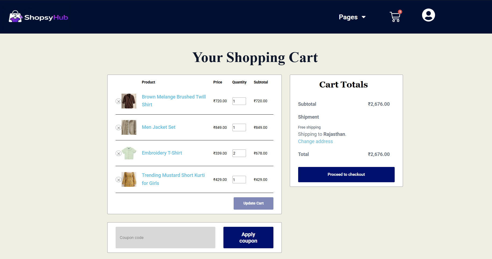

# 🛍️ ShopsyHub - WordPress E-commerce Website

## 📌 Project Description

ShopsyHub is a fully responsive e-commerce website built using WordPress. It allows users to browse products, view details, and simulate an online shopping experience.

## 🚀 Features

* Responsive design (mobile + desktop)
* Product listing pages
* Category-wise filtering
* Add to cart functionality
* Clean UI using Elementor
* Popup offers for user engagement
* Spin-to-win (Lucky Wheel) feature for discounts

## 🛠️ Technologies Used

* WordPress

### 🎨 Theme

* Astra Theme (customized using Elementor)

### 🔌 Plugins

* Elementor (for page building)
* Elementor Pro (for advanced design features)
* WooCommerce (for e-commerce functionality)
* Popup Maker (for promotional popups and offers)
* Lucky Wheel (for gamified discount offers)

## 📸 Screenshots

### 🏠 Homepage

### 🛍️ Product Page

### 🛒 Cart Page

## 🌐 Live Website

https://shopsyhub.xyz/

## 👩‍💻 Author

Mamta Soni
